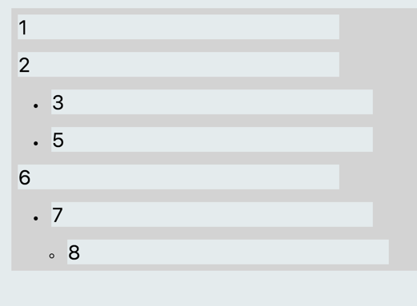

# Introduction

This web app provides a minimal interface for hierarchical text input. The simple hierarchical structure allows the user to organize their unstructured ideas in a natural way. 

The app is built on ReactJS and TypeScript.

 

## View components (src/components):
- The entrypoint view is the *app* view contained in `index.tsx`. 
- `NodeList.tsx` This view contains a collection of *items*. Each item represents a line in which the user can type. The code in app.tag initializes the first item and handles the keyboard events up, down, tab, shif-tab, and enter. The enter key creates a new item in the next line.
- The item view in the file `item.tsx` contains a text input. It is associated with one `Node` object and handles the tab, shift-tab operations when triggered by the app. 

## Model (src/store)
- The datastore is contained in the store/NodeHolder.tsx. It contains the class Node. Each object is composed of a title and a list of child Node objects. The class provides methods allowing basic operations to add child, remove child, retrieve siblings, and retrieve the index of a child. The method `getOrderedFlatNodeList` is called to generate the flat list of nodes.

# To run
1. Run this command in the directory
`python -m SimpleHTTPServer`
2. Open [http://localhost:8000/](http://localhost:8000/)

## For Dev
1. Run `npm install` and then `webpack`

# Features
1. Allows the use of keys: (tab / shift-tab) to modify the indent  and up/down to traverse the tree

# TODO
1. Clone when node is dragged and shift key is pressed
2. Flux implementation
